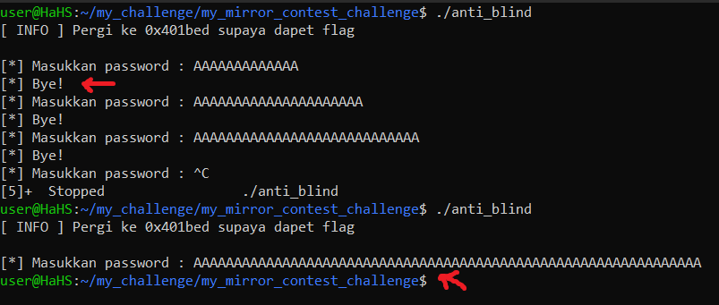
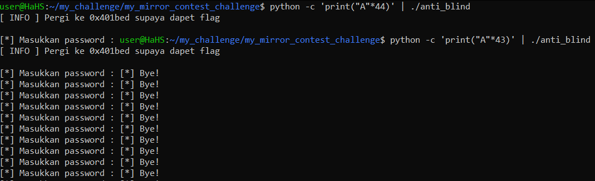
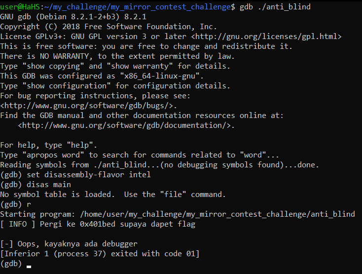
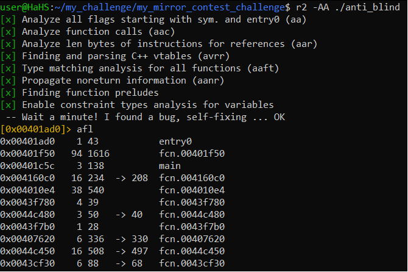
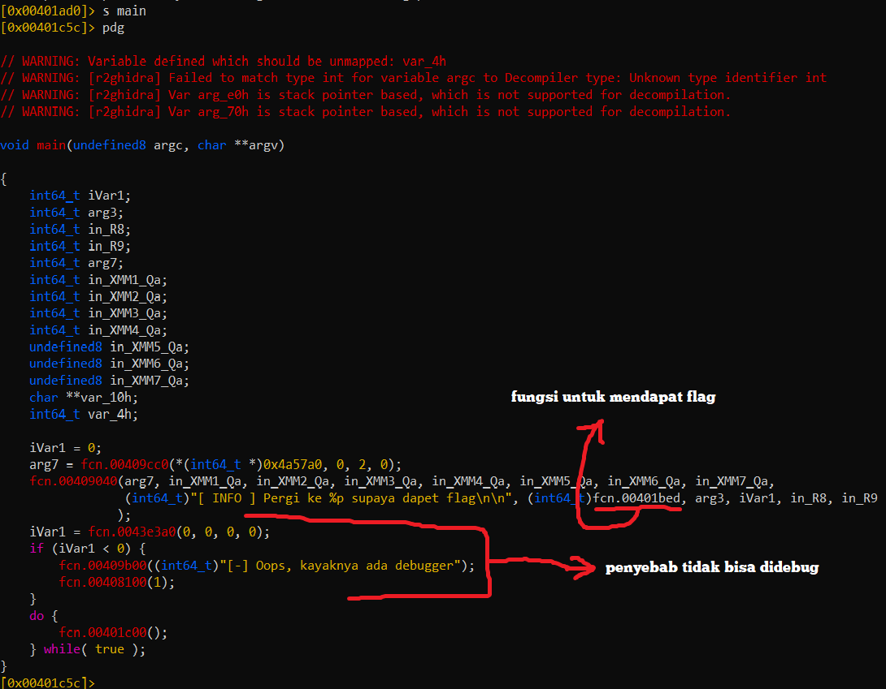
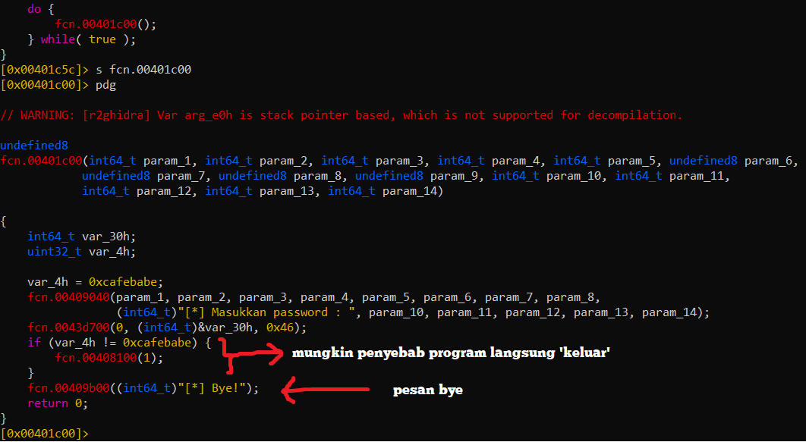
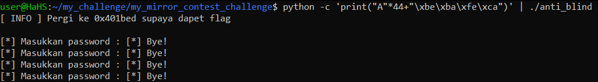
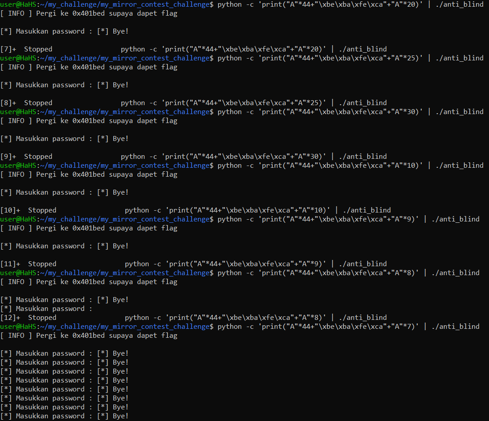
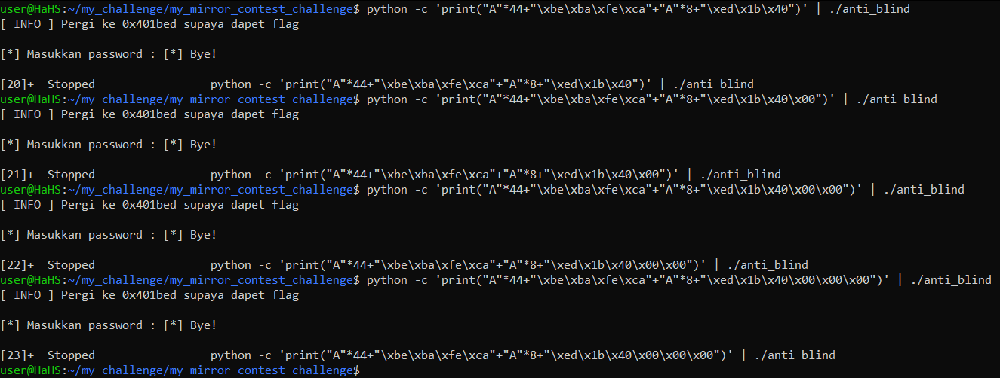
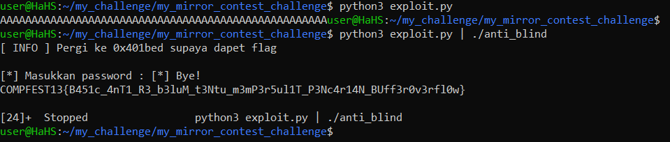

# Writeup Kode Buta
Task ini terinspirasi dari [livestream Gynvael tentang blind return oriented programming](https://www.youtube.com/watch?v=OAk23u9b-88&list=PL0ZCORAYPo2AVflF8N9Usn5mVAm97px6-&index=25) namun dimodifikasi menjadi \'blind bufferoverflow\'. Pada challenge bertipe blind, umumnya user tidak mendapat akses / kode \(intinya sesuatu yang bisa dilihat / dicek secara langsung ketika terjadi suatu masalah\), namun pada task ini, untuk mempermudah task, user diberikan binary tetapi tidak diberikan source code. Binary-nya memiliki anti-debugger, dicompile dengan static-link dan di-strip untuk membuat binary-nya sedikit susah dilihat \(seolah-olah blind\).

Alasan lain user mendapatkan binary adalah pada celah bertipe \'blind\' umumnya membutuhkan resource yang besar \(terkadang harus bruteforce\) untuk menerima jumlah request yang besar karena user tidak memiliki aplikasinya dan request-request dengan jumlah yang besar itu digunakan untuk menganalisis kondisi servicenya.

## POC

1. Pertama, coba programnya di test dengan input yang pendek dan panjang. Dari input yang pendek dan panjang, ada perbedaan yang mencolok yaitu pada input yang panjang dimana tidak ada tulisan Bye\! dan program langsung berhenti. Namun, jika diberikan input sepanjang apapun, programnya tetap akan berhenti dan tidak ada tanda-tanda SIGSEV \/ segmentation fault. 

    

2. Dari kondisi diatas, kita bisa menebak bahwa ada semacam \'value\' dimana value itu dicek. Jika valuenya berubah dari yang seharusnya, maka programnya kemungkinan \'exit\' sehingga kita tidak pernah mendapatkan tanda-tanda segmentation vault\(karena programnya tidak return\). Jadi, kita perlu cari posisi / index dimana programnya tidak menuliskan Bye\!. Karena kemungkinan besar programnya menggunakan infinite loop supaya bisa berjalan terus, kita bisa menggunakan \'python -c\' untuk mempermudah pencarian.\
\
Jika hasil dari \'python -c\' di pipe ke binarynya dan berjalan tidak berhenti, maka kemungkinan besar kita belum menghantam \'value\' itu. Dari percobaan dibawah, kita tau kalau kita perlu 44 karakter untuk menghantam \'value\' supaya berhenti.\
\
\
\
Namun, bagi yang sering belajar bufferoverflow, dari hasil gambar diatas, kemungkinan besar 44 itu adalah buffernya berukuran 40 dan biasanya ada padding sekitar 4 atau 8 byte. Secara logika, harusnya kita belum meng-overwrite \'value\'nya tetapi kenapa berhenti? Kemungkinan besar \'value\'nya terhantam dengan NULL byte. Karena setiap string di C diakhiri dengan NULL byte, mungkin ketika diberikan input 44 karakter (45 karakter dengan NULL byte), NULL byte-nya mengoverwrite si \'value\'. Jadi, kita tau kalo kita perlu 44 karakter untuk menyentuh si \'value\'.

3. Secara naluriah, user pada umumnya menggunakan debugger untuk melihat alur program. Namun sayangnya, binary ini mempunyai anti-debugger\(ptrace_traceme\) dan kemungkinan distrip (dikarenakan tidak bisa \'disas main\' / melihat hasil disassembly fungsi main).\
\
\
\
Sebenarnya, saat ini adalah kondisi / inti dari challenge bertipe \'blind\' dimana kita perlu melakukan bruteforce terhadap \'value\' itu jikalau user tidak mendapatkan attachment apapun pada task ini. Dimana user men-bruteforce semua kemungkinan nilai dari 1 sampai N byte si \'value\' itu \(karena belum tentu / bisa diasumsikan valuenya itu cuman 4 / 8 byte). Jika pada proses bruteforce ada tulisan Bye\!, maka nilai yang dibruteforce itu adalah benar.

4. Karena ada anti-debugger dan kita tidak bisa melihat fungsi main, kita perlu menganalisis binarynya secara manual dengan decompiler. Disini saya menggunakan radare2 dengan r2ghidra untuk dekompilasinya.\
\
\
\
Dari hasil analisis radare2 diatas, kita bisa melihat main namun kita tidak bisa melihat fungsi apapun selain itu.

5. Kita gunakan r2ghidra untuk mendecompile fungsi main. 
\
\
\
Dari gambar diatas, kita perlu melihat fungsi yang ada didalam loop karena kemungkinan besar fungsi itu yang mempunya efek \'exit\'.

6. Dari gambar dibawah, kemungkinan besar value yang menyebabkan efek \'exit\' adalah 0xcafebabe.\
\

7. Maka kita coba input dengan 44 karakter dan 0xcafebabe dan programnya berhasil menuliskan Bye\!.\
\

8. Sekarang kita coba menambahkan data berlebih lagi untuk mengetahui dimana posisi / index dari awal return address untuk mengoverwrite RIP. Kita coba menaikan jumlah input tapi karena selalu stop / kemungkinan segmentation fault, maka kita coba turunin jumlah karakternya.\
\
\
\
Dari gambar diatas, pada saat menambahkan 7 karakter A , program tidak berhenti tapi pada saat memberikan 8 karakter A muncul tulisan masukkan password lagi. Ini mungkin terjadi diakibatkan oleh NULL byte yang mengoverwrite byte RIP paling kecil sehingga programmnya seolah-olah mundur lagi karena alamat RIPnya mengecil. Jadi, kita tau kalau kita butuh 8 byte lagi sebelum return address \(mungkin karena padding\).

9. Sekarang kita tinggal tambahin address yang mau kita tuju tapi berdasarkan gambar dibawah, kita belom bisa mengakses alamat yang ingin kita tuju. Mungkin dengan bantuan kode python bisa lebih baik daripada menggukan command line python.
\

10. Kita buat exploit.py dan pipe hasil stdout-nya ke binary-nya dan berhasil.\
\
